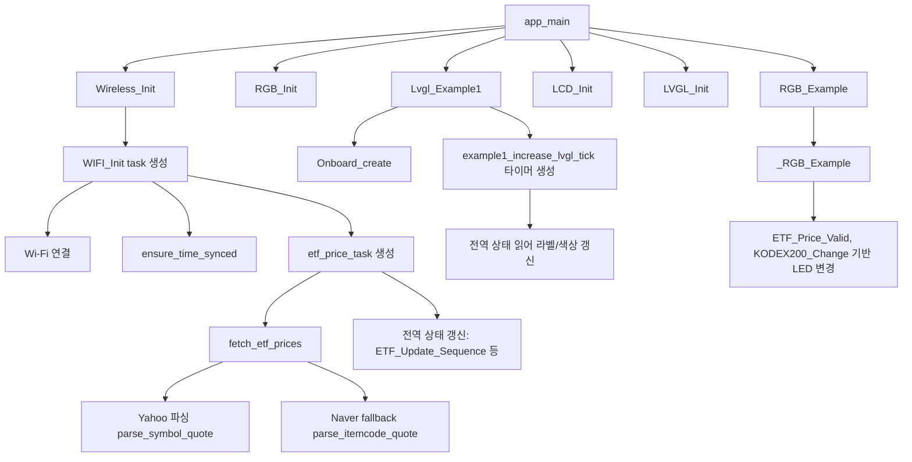

# ESP32-C6-LCD-1.47 예제를 KODEX200 시세 표시기로 바꿔보기

  ESP-IDF
  LVGL
  KODEX200

이번 프로젝트는 ESP32-C6-LCD-1.47 보드의 기본 예제를 바탕으로, KODEX200 ETF 값을 가져와 LCD에 표시하는 형태로 바꿔본 작업이다. 원래 예제는 디스플레이와 LVGL 구동 확인에 초점이 맞춰져 있었지만, 여기에 Wi-Fi 연결, HTTPS 통신, 주기적 데이터 갱신, UI 표시를 붙여 조금 더 실용적인 시세 보드 형태로 확장했다. 이 글에서는 예제 코드가 어떤 구조였는지, 그리고 어떤 부분을 바꿔 원하는 기능으로 발전시켰는지를 정리한다.

---

## 📸 완성 화면

<!-- 여기에 완성 화면 사진 삽입 -->

캡션: ESP32-C6-LCD-1.47 보드에서 KODEX200 시세를 표시하는 최종 화면. 예제 데모 UI를 정보 표시용 화면으로 바꿔 가격, 등락값, 등락률을 한 번에 확인할 수 있도록 구성했다.

이 프로젝트의 핵심은 새 애플리케이션을 처음부터 만드는 대신, 이미 동작하는 예제의 구조를 유지한 채 데이터 입력부와 화면 출력부를 목적에 맞게 바꿨다는 점이다. 결과적으로 LCD 출력, 무선 연결, 시세 갱신, 상태 표시가 하나의 흐름으로 묶인 작은 시세 보드가 되었다.

---

## 1. 개발 환경과 출발점

개발은 ESP-IDF 5.4.1 기준으로 진행했고, 대상 보드는 ESP32-C6-LCD-1.47이다. 플래시는 UART 방식으로 진행했고, LCD와 RGB LED, SD, Wi-Fi가 한 프로젝트 안에서 함께 동작하도록 구성했다. 이런 종류의 보드는 센서 없이도 네트워크 데이터와 UI를 바로 연결해볼 수 있다는 점에서, 예제 코드를 실용적인 결과물로 확장하기에 꽤 좋은 출발점이다.

환경 구성은 길게 적기보다 재현에 필요한 정보만 짧게 남기는 편이 기술 블로그에 더 잘 맞는다. 실제로 개발에 사용한 타깃 칩, 포트, 플래시 방식은 [.vscode/settings.json](.vscode/settings.json#L2) 부근에 정리되어 있고, 여기서 타깃이나 포트가 어긋나면 이후 빌드와 다운로드 과정에서 바로 문제가 생긴다.

간단히 정리하면 이번 프로젝트의 전제 조건은 아래 정도면 충분하다.

- ESP-IDF 5.4.1
- esp32c6 타깃
- COM14 포트
- UART 플래시 방식

---

## 2. 원본 예제 구조는 어떻게 되어 있었나

프로젝트 구조를 이해하는 가장 빠른 방법은 [main/main.c](main/main.c#L13) 를 먼저 보는 것이다. 이 파일에는 무선 기능 초기화, RGB 초기화, SD 초기화, LCD 초기화, LVGL 초기화, 그리고 최종 화면 생성까지의 흐름이 순서대로 들어 있다. 임베디드 프로젝트에서는 초기화 순서가 안정성과 직접 연결되기 때문에, 기능을 추가하더라도 이 순서를 크게 흔들지 않는 것이 중요했다.

특히 이 프로젝트에서는 Wireless_Init 이후 LCD와 LVGL을 순차적으로 올리고, 마지막 루프에서 lv_timer_handler 를 주기적으로 호출하는 구조를 유지했다. 이 부분은 단순한 보일러플레이트처럼 보여도 실제로는 UI가 계속 갱신되기 위한 핵심 조건이다. 예제 기반 프로젝트를 수정할 때는 바로 기능을 덧붙이기보다, 먼저 이런 앱 시작 흐름을 읽고 어디에 무엇을 끼워 넣을지 판단하는 것이 훨씬 안전하다.

코드를 조금 더 들여다보면 [main/main.c](main/main.c#L15) 부근의 호출 순서는 사실상 의존 관계를 드러낸다. Wireless_Init 은 이후 화면에 표시할 데이터의 공급원을 준비하고, RGB_Init 과 RGB_Example 은 별도 태스크 기반 상태 표시를 시작한다. 그다음 SD와 LCD를 준비한 뒤 LVGL_Init 과 Lvgl_Example1 을 호출하는데, 이 순서 덕분에 화면 객체가 만들어지는 시점에는 이미 주변 장치 초기화가 끝난 상태가 된다. 즉, main.c 는 단순 시작 파일이 아니라 각 모듈의 책임이 어디서 연결되는지를 가장 압축적으로 보여주는 파일이다.

<!-- 여기에 앱 구조 설명용 코드 스크린샷 삽입 -->

캡션: 앱 시작 시 무선, LCD, LVGL이 어떤 순서로 초기화되는지 보여주는 진입점. 예제 구조를 유지하면서 필요한 기능만 덧붙이는 방향으로 접근했다.

### 코드 캡처 1. 앱 시작 흐름

<!-- 사진 넣을 곳: main_main_flow.png -->

추천 캡처 범위: [main/main.c](main/main.c#L13)

이 코드는 프로젝트 전체를 가장 짧게 설명해 주는 진입점이다. 무선 초기화부터 RGB 상태 표시, LCD 준비, LVGL 초기화, 그리고 사용자 화면 생성까지가 한 함수 안에서 이어진다. 블로그에서는 이 캡처를 먼저 보여준 뒤, "이 프로젝트는 데이터를 가져오는 모듈과 화면을 그리는 모듈을 별도로 두고, main.c 에서 이 둘을 연결한다"고 설명하면 흐름이 바로 잡힌다.

특히 마지막 while 루프에서 lv_timer_handler 를 반복 호출하는 부분은 단순 반복문이 아니라 LVGL 화면이 계속 살아 있도록 만드는 핵심 루프다. 이 한 장의 캡처만으로도 예제 기반 프로젝트를 어떻게 확장했는지를 꽤 설득력 있게 보여줄 수 있다.

---

## 2-1. 함수 호출 순서로 보는 전체 동작

맞다. 이 주제는 파일 링크 중심 설명보다 함수 단위 캡처 + 호출 흐름 설명이 훨씬 이해가 쉽다. 그래서 본문에서는 아래 순서로 "함수가 어떻게 이어져서 동작하는지"를 먼저 보여주고, 그다음 각 함수 캡처를 붙이는 구성을 추천한다.

### 함수별 설명 요약

1. 앱 진입과 모듈 연결
- 함수: app_main
- 위치: [main/main.c](main/main.c#L13)
- 역할: 네트워크, RGB, LCD, LVGL을 초기화하고 메인 루프에서 lv_timer_handler 를 반복 호출한다.
- 캡처 이유: 전체 아키텍처를 한 장으로 설명할 수 있다.

2. 네트워크 시작점
- 함수: Wireless_Init
- 위치: [main/Wireless/Wireless.c](main/Wireless/Wireless.c#L729)
- 역할: NVS 초기화 후 WIFI_Init 태스크를 생성한다.
- 캡처 이유: "앱 시작"과 "네트워크 태스크"가 연결되는 지점이다.

3. Wi-Fi 연결과 시세 태스크 기동
- 함수: WIFI_Init
- 위치: [main/Wireless/Wireless.c](main/Wireless/Wireless.c#L761)
- 역할: Wi-Fi 스택 초기화, 이벤트 핸들러 등록, 연결 시도, 시간 동기화 후 etf_price_task 생성.
- 캡처 이유: 실제 런타임 시작 조건(연결 성공 후 태스크 시작)이 드러난다.

4. 시세 수집 메인 루프
- 함수: etf_price_task
- 위치: [main/Wireless/Wireless.c](main/Wireless/Wireless.c#L625)
- 역할: 주기적으로 fetch_etf_prices 를 호출하고 전역 상태를 갱신한다.
- 캡처 이유: 데이터 수집 주기와 UI 반영의 시작점이 보인다.

5. 데이터 소스 조회와 정규화
- 함수: fetch_etf_prices
- 위치: [main/Wireless/Wireless.c](main/Wireless/Wireless.c#L548)
- 역할: Yahoo 조회 우선, 실패 시 Naver fallback, 결과를 공통 포맷으로 정리.
- 캡처 이유: 장애 대응과 데이터 정규화를 동시에 보여준다.

6. Yahoo/Naver 파싱 핵심
- 함수: parse_symbol_quote, parse_itemcode_quote
- 위치: [main/Wireless/Wireless.c](main/Wireless/Wireless.c#L271), [main/Wireless/Wireless.c](main/Wireless/Wireless.c#L355)
- 역할: 문자열 기반 JSON 필드 추출, 가격/등락/등락률 값 변환.
- 캡처 이유: 메모리 절약형 파싱 전략과 trade-off 설명에 좋다.

7. UI 생성 시작점
- 함수: Lvgl_Example1, Onboard_create
- 위치: [main/LVGL_UI/LVGL_Example.c](main/LVGL_UI/LVGL_Example.c#L71), [main/LVGL_UI/LVGL_Example.c](main/LVGL_UI/LVGL_Example.c#L227)
- 역할: 스타일 초기화 후 시세 표시 레이아웃을 만든다.
- 캡처 이유: 화면 구조 설계를 보여주기 좋다.

8. UI 실시간 갱신
- 함수: example1_increase_lvgl_tick
- 위치: [main/LVGL_UI/LVGL_Example.c](main/LVGL_UI/LVGL_Example.c#L270)
- 역할: ETF_Update_Sequence 를 기준으로 진행 바와 텍스트/색상을 갱신한다.
- 캡처 이유: 데이터-UI 연결 로직을 가장 명확하게 보여준다.

9. 보조 상태 표시
- 함수: _RGB_Example
- 위치: [main/RGB/RGB.c](main/RGB/RGB.c#L30)
- 역할: 데이터 유효 여부와 등락 방향에 따라 LED 색상을 변경한다.
- 캡처 이유: 화면 외 상태 피드백 채널 설명에 유용하다.

### 함수 캡처 템플릿

아래 형식을 함수 캡처마다 반복하면 글이 깔끔해진다.

- 함수명:
- 호출 주체:
- 입력/참조 상태:
- 출력/부수효과:
- 실패 시 동작:
- 이 함수를 캡처한 이유:

---

## 3. KODEX200 데이터를 가져오기 위해 추가한 것들

실제 시세 표시기로 동작하려면 네트워크 계층이 먼저 안정적으로 붙어야 한다. 이 프로젝트에서는 [main/Wireless/Wireless.c](main/Wireless/Wireless.c#L38) 에서 Wi-Fi 연결, SSID 후보 전환, 시간 동기화, HTTPS 요청과 같은 흐름을 담당한다. 단일 SSID만 고정해 두는 대신 여러 후보를 배열로 관리하고 실패 시 다음 후보로 넘어가도록 만든 점은 실제 사용성을 고려한 설계다. 공유기 위치나 설치 장소가 바뀌면 같은 장치라도 네트워크 조건이 꽤 달라질 수 있기 때문이다.

또 하나 중요한 포인트는 HTTPS 요청 전에 시간을 맞추는 처리다. [main/Wireless/Wireless.c](main/Wireless/Wireless.c#L125) 에는 SNTP로 시스템 시간을 맞추는 로직이 들어 있는데, 인증서 검증이 필요한 연결에서는 시간이 크게 틀어져 있으면 요청 자체가 실패할 수 있다. 데스크톱 환경에서는 거의 의식하지 않는 부분이지만, 임베디드 장치에서는 꽤 자주 부딪히는 문제다.

실제 시세 조회는 Yahoo Finance 쿼리를 먼저 시도하고, 실패 시 Naver Finance 기반 조회로 fallback 하는 구조로 짜여 있다. 이 부분은 [main/Wireless/Wireless.c](main/Wireless/Wireless.c#L556) 부근에서 확인할 수 있다. 즉, 단순히 값을 받아오는 것이 아니라 데이터 소스 실패에도 어느 정도 대응하도록 설계된 셈이다.

또한 종목 심볼과 갱신 주기는 코드에 하드코딩하지 않고 [main/Kconfig.projbuild](main/Kconfig.projbuild#L74) 에서 설정값으로 분리했다. 이런 구조 덕분에 KODEX200 외 다른 종목으로 바꾸거나 업데이트 주기를 조정할 때도 코드를 크게 수정할 필요가 없다.

여기서 흥미로운 점은 JSON 처리를 무거운 파서 라이브러리로 하지 않고, 문자열 검색 기반으로 필요한 필드만 직접 뽑아낸다는 것이다. [main/Wireless/Wireless.c](main/Wireless/Wireless.c#L271) 의 parse_symbol_quote 는 symbol, regularMarketPrice, regularMarketChange, regularMarketChangePercent 같은 키를 strstr 로 찾고 strtod 로 숫자로 변환한다. 구현은 단순하지만, 필요한 값이 몇 개 되지 않는 임베디드 환경에서는 메모리 사용량과 코드 복잡도를 낮출 수 있다는 장점이 있다. 대신 응답 JSON 구조가 바뀌면 쉽게 깨질 수 있다는 점은 분명한 trade-off 다.

fallback 쪽도 비슷하다. [main/Wireless/Wireless.c](main/Wireless/Wireless.c#L355) 의 parse_itemcode_quote 는 Naver 응답에서 종목 코드와 현재가, 전일 대비, 등락률을 직접 찾아 해석한다. 특히 rf 플래그를 보고 상승과 하락 부호를 다시 맞추는 부분은, 단순 숫자 파싱만으로는 부족한 시장 데이터 해석 로직이 어디에 들어가야 하는지를 잘 보여준다. 즉, 이 모듈은 단순 HTTP 클라이언트가 아니라 “시세 데이터 정규화 계층”에 더 가깝다.

또 한 가지 눈에 띄는 건 상태 공유 방식이다. [main/Wireless/Wireless.h](main/Wireless/Wireless.h#L16) 에 선언된 전역 상태 값들은 네트워크 태스크, UI, RGB 표시가 모두 참조하는 공용 데이터다. etf_price_task 가 가격과 등락폭, 상태 문자열, 업데이트 시퀀스를 갱신하면 LVGL 타이머와 RGB 태스크가 이를 읽어 각자 화면과 LED를 바꾼다. 구조는 단순하지만, "수집", "표시", "보조 표시"를 느슨하게 분리하면서도 별도 메시지 큐 없이 연결했다는 점에서 꽤 실용적이다.

<!-- 여기에 Wi-Fi 후보 / 시간 동기화 / 시세 요청 코드 스크린샷 삽입 -->

캡션: 시세 조회 전에 Wi-Fi 연결과 시간 동기화를 먼저 맞추고, Yahoo 조회 실패 시 다른 경로를 시도하도록 구성한 네트워크 처리 흐름.

### 코드 캡처 2. 시세 조회와 fallback 처리

<!-- 사진 넣을 곳: wireless_fetch_fallback.png -->

추천 캡처 범위: [main/Wireless/Wireless.c](main/Wireless/Wireless.c#L556)

이 부분은 블로그에서 꼭 보여줄 가치가 있다. 먼저 Yahoo Finance URL을 만들고 데이터를 요청한 뒤, 파싱에 실패하면 Naver 기반 조회로 넘어가는 흐름이 한 번에 드러나기 때문이다. 단순히 "외부 API를 썼다"는 설명보다, 실제 실패를 가정하고 fallback 경로를 넣었다는 점이 코드 수준에서 보이는 장면이다.

여기서는 "이 모듈은 HTTP 호출만 하는 것이 아니라, 서로 다른 응답 형식을 공통 상태값으로 정리하는 역할까지 맡는다"고 설명하면 좋다. 그 한 문장만 있어도 글이 단순 제작기를 넘어서 설계 분석에 가까워진다.

---

## 4. 받은 데이터를 LCD에 어떻게 보여주도록 바꿨나

화면 구성은 [main/LVGL_UI/LVGL_Example.c](main/LVGL_UI/LVGL_Example.c#L71) 에서 담당한다. 기존 LVGL 예제 화면을 그대로 쓰지 않고, KODEX200과 KODEX SMR의 가격과 변화량을 표시하는 정보형 UI로 바꾼 것이 핵심이다. 작은 LCD에서는 정보량보다 가독성이 더 중요하기 때문에, 숫자 포맷, 색상 구분, 갱신 상태 표시가 실제 체감 품질에 큰 영향을 준다.

예를 들어 [main/LVGL_UI/LVGL_Example.c](main/LVGL_UI/LVGL_Example.c#L172) 부근에는 가격에 천 단위 구분기호를 붙이고, 등락값과 등락률을 부호와 함께 표시하기 위한 포맷팅 함수가 들어 있다. 이런 함수는 단순 문자열 가공처럼 보이지만, 작은 디스플레이에서 숫자를 빠르게 읽히게 만드는 데 꽤 큰 역할을 한다.

레이아웃 자체는 [main/LVGL_UI/LVGL_Example.c](main/LVGL_UI/LVGL_Example.c#L227) 부근에서 만들어지고, 실제 값 갱신은 [main/LVGL_UI/LVGL_Example.c](main/LVGL_UI/LVGL_Example.c#L270) 부근의 타이머 콜백에서 처리된다. 이 콜백에서는 최신 데이터가 들어왔는지 확인하고, 가격과 등락률 문자열을 다시 만들고, 상승과 하락에 따라 텍스트 색과 진행 바 색을 바꾼다. 값이 아직 없을 때는 Loading 대신 현재 상태 문자열을 보여주도록 처리한 점도 실제 사용성을 높여준다.

코드 구조를 보면 UI 쪽도 역할이 분리되어 있다. [main/LVGL_UI/LVGL_Example.c](main/LVGL_UI/LVGL_Example.c#L227) 의 Onboard_create 는 화면 객체를 생성하고 라벨, 진행 바, 스타일을 배치하는 역할만 맡는다. 반면 [main/LVGL_UI/LVGL_Example.c](main/LVGL_UI/LVGL_Example.c#L270) 의 example1_increase_lvgl_tick 은 데이터 상태를 읽어 실제 텍스트와 색상을 갱신한다. 즉, 생성과 갱신을 분리해 둔 덕분에 UI 초기 배치 코드와 실시간 반영 로직이 서로 덜 얽혀 있다.

이 타이머 콜백에서 특히 좋은 부분은 ETF_Update_Sequence 를 이용한 갱신 감지다. 네트워크 태스크가 새 데이터를 가져올 때마다 시퀀스를 올리고, UI는 이 값이 바뀌었는지만 확인해 refresh bar 를 다시 채운다. 이 방식은 시간을 직접 계산하지 않고도 “새 데이터가 들어왔는지”를 UI 관점에서 간단히 판단할 수 있게 해준다. 임베디드 UI에서는 이런 작은 상태 플래그 하나가 전체 구조를 훨씬 단순하게 만든다.

문자열 갱신 방식도 의도적이다. 코드에서는 새로 만든 문자열이 이전 문자열과 다를 때만 lv_label_set_text 를 호출한다. 이런 패턴은 LVGL 호출을 불필요하게 반복하지 않도록 해 주고, 작은 장치에서 잦은 UI 업데이트로 인한 부담을 줄이는 데 도움이 된다. 겉으로는 사소해 보여도, 실제 장치에서 화면 갱신이 많은 경우 꽤 의미 있는 습관이다.

<!-- 여기에 UI 레이아웃 코드 스크린샷 삽입 -->

캡션: LVGL 예제 화면을 KODEX200 시세 보드 형태로 바꾸는 레이아웃 생성 구간. 제목, 값 표시 영역, 갱신 바를 한 화면에 배치했다.

### 코드 캡처 3. UI 레이아웃 생성

<!-- 사진 넣을 곳: lvgl_layout_create.png -->

추천 캡처 범위: [main/LVGL_UI/LVGL_Example.c](main/LVGL_UI/LVGL_Example.c#L227)

이 캡처는 예제용 LVGL 화면이 실제 정보 표시 화면으로 어떻게 바뀌었는지를 보여주는 핵심 장면이다. 종목명 라벨, 가격 표시 라벨, 갱신 진행 바가 순서대로 생성되는 모습이 들어 있기 때문에, 화면 구성이 어떤 의도로 짜였는지 설명하기 쉽다.

본문에서는 "화면을 화려하게 꾸미기보다, 작은 LCD에서 정보를 빠르게 읽히게 만드는 방향으로 레이아웃을 단순화했다"고 적으면 좋다. 그다음 각 객체가 어떤 역할을 하는지 한두 문장만 덧붙이면 충분하다.

<!-- 여기에 값 갱신 로직 코드 스크린샷 삽입 -->

캡션: 주기적으로 최신 데이터를 읽어 라벨과 색상을 갱신하는 부분. 가격, 등락값, 등락률을 한 문자열로 묶어 화면에 반영한다.

### 코드 캡처 4. UI 갱신 로직

<!-- 사진 넣을 곳: lvgl_update_logic.png -->

추천 캡처 범위: [main/LVGL_UI/LVGL_Example.c](main/LVGL_UI/LVGL_Example.c#L270)

이 부분은 실제 데이터가 화면으로 반영되는 과정을 설명할 때 가장 좋은 캡처다. ETF_Update_Sequence 로 새 데이터 도착 여부를 확인하고, refresh bar 값을 조절하고, 가격과 등락률 문자열을 만든 뒤, 상승과 하락에 따라 텍스트 색을 바꾸는 흐름이 모두 들어 있다.

설명 문단에서는 "UI 객체 생성과 데이터 반영 로직을 분리해 두었기 때문에, 화면 구조를 설명하는 코드와 실제 갱신 코드를 따로 읽을 수 있다"고 짚어주면 좋다. 여기에 "문자열이 바뀐 경우에만 lv_label_set_text 를 호출한다"는 점까지 덧붙이면 분석 밀도가 높아진다.

---

## 5. 화면 말고도 상태를 어떻게 표현했나

이 프로젝트는 화면 출력 외에도 RGB LED를 보조 상태 표시로 활용한다. [main/RGB/RGB.c](main/RGB/RGB.c#L30) 를 보면 데이터가 아직 유효하지 않을 때는 중립색을 켜고, KODEX200이 상승이면 붉은 계열, 하락이면 푸른 계열로 LED 색을 바꾸도록 되어 있다. 즉, 숫자를 직접 읽지 않아도 현재 상태를 한눈에 파악할 수 있게 만든 것이다.

이런 보조 신호는 작은 임베디드 장치에서 생각보다 유용하다. 화면은 자세히 읽어야 하지만, LED는 멀리서도 장치 상태를 알려줄 수 있기 때문이다. 그래서 이 부분은 단순 장식이 아니라 상태 전달 채널을 하나 더 추가한 설계 포인트로 설명하는 편이 좋다.

구현 자체는 단순하지만 구조적으로는 꽤 깔끔하다. [main/RGB/RGB.c](main/RGB/RGB.c#L30) 의 _RGB_Example 태스크는 별도의 계산을 하지 않고 ETF_Price_Valid 와 KODEX200_Change 라는 공용 상태만 읽는다. 다시 말해, LED 모듈은 데이터 수집 방식이나 UI 구조를 몰라도 되고, 오직 "지금 상태가 무엇인가"만 알면 된다. 이런 방식은 모듈 간 결합도를 낮추고, 나중에 LED 정책만 따로 바꾸기도 쉽게 만든다.

<!-- 여기에 RGB LED 동작 코드 또는 사진 삽입 -->

캡션: 화면 정보와 별개로, 현재 데이터 상태와 시세 방향을 RGB LED 색으로도 전달하도록 구성했다.

---

## 6. 바이브 코딩으로 만들었지만, 검증은 따로 필요했다

이번 작업은 상당 부분을 바이브 코딩 방식으로 빠르게 밀어붙였다. 이미 동작하는 예제를 기반으로 필요한 기능을 덧붙이고, 결과를 보면서 구조를 정리하는 식으로 진행한 것이다. 이런 방식은 초반 속도가 빠르다는 장점이 있다. 화면이 먼저 살아나고, 네트워크가 붙고, 값이 보이기 시작하면 프로젝트가 금방 실체를 갖는다.

하지만 임베디드에서는 여기서 끝내기 어렵다. 초기화 순서가 조금만 어긋나도 화면이 비정상적으로 동작할 수 있고, 시간 동기화가 안 되면 HTTPS가 실패할 수 있고, 값이 아직 없을 때의 UI 처리를 놓치면 결과가 쉽게 어색해진다. 그래서 이번 프로젝트에서는 AI를 활용해 빠르게 전진하되, 초기화 순서, 연결 실패 케이스, UI 갱신 타이밍, 실제 보드 출력은 결국 직접 확인해야 했다.

실제 코드 기준으로 보면 사람이 꼭 확인해야 하는 지점도 비교적 명확하다. [main/Wireless/Wireless.c](main/Wireless/Wireless.c#L422) 이후의 HTTP 처리 코드는 서버 응답 길이와 상태 코드를 전제로 동작하므로, 응답 형식이 바뀌거나 길이 정보가 비정상적일 때 어떤 로그가 남는지 확인해야 한다. 또 [main/LVGL_UI/LVGL_Example.c](main/LVGL_UI/LVGL_Example.c#L270) 의 UI 타이머는 1초 주기로 돌아가므로, 실제 업데이트 주기와 화면 잔상이 자연스러운지 장치에서 봐야 한다. 결국 이런 부분은 코드를 읽는 것만으로 충분하지 않고, 로그와 실제 화면을 함께 봐야 검증이 끝난다.

이 경험을 정리하면, 바이브 코딩은 출발 속도를 높이는 데는 확실히 유용하지만, 하드웨어가 얽히는 순간부터는 검증을 대신해 주지 않는다. 특히 임베디드 프로젝트에서는 "컴파일된다"와 "장치에서 안정적으로 동작한다" 사이의 간격이 꽤 크다는 점을 다시 느꼈다.

---

## 7. 마무리

정리하면 이번 작업은 ESP32-C6-LCD-1.47 예제를 출발점으로 삼아, 외부에서 KODEX200 시세를 가져와 LCD에 표시하는 형태로 확장한 프로젝트였다. 단순히 값을 띄우는 데서 끝나지 않고, Wi-Fi 연결, 시간 동기화, 데이터 포맷팅, UI 갱신, 상태 표현까지 함께 다뤄야 했다는 점에서 예제 이상의 의미가 있었다. 예제 코드를 내 목적에 맞게 변형하는 과정 자체가 꽤 좋은 학습 경험이었고, 이후에는 종목 수를 늘리거나 입력 인터페이스를 붙이는 방향으로도 충분히 확장할 수 있을 것 같다.

---

## 📷 사진 배치 추천

1. 도입 직후 완성 화면 1장
캡션: ESP32-C6-LCD-1.47 보드에서 KODEX200 시세를 표시하는 최종 화면.

2. 2장째는 부팅 직후 화면
캡션: 네트워크 연결과 데이터 수신 전 초기 상태 화면. 값이 아직 없을 때는 Loading 또는 상태 문자열을 표시한다.

3. UI 설명 챕터에서 갱신 후 화면 1장
캡션: Wi-Fi 연결 후 실제 시세 데이터가 반영된 화면. 가격, 등락값, 등락률을 한 번에 확인할 수 있다.

4. RGB 설명 챕터에서 LED 사진 1장
캡션: 화면 외에도 RGB LED 색으로 현재 상태와 시세 방향을 보조적으로 표현했다.

5. 가능하면 마지막에 개발 중 사진 1장
캡션: ESP-IDF 환경에서 예제 프로젝트를 바탕으로 네트워크와 UI를 함께 검증하던 모습.

6. 코드 설명 챕터에서 앱 시작 흐름 캡처 1장
캡션: 앱 시작 시 무선, 디스플레이, LVGL이 어떤 순서로 연결되는지 보여주는 진입점.

7. 네트워크 설명 챕터에서 시세 조회 fallback 캡처 1장
캡션: Yahoo 조회 실패 시 다른 경로로 넘어가도록 구성한 실제 데이터 수집 흐름.

8. UI 설명 챕터에서 레이아웃 생성 캡처 1장
캡션: 종목명, 가격, 갱신 진행 바를 배치하는 LVGL 레이아웃 생성 코드.

9. UI 설명 챕터에서 갱신 로직 캡처 1장
캡션: 최신 데이터 도착 여부에 따라 문자열과 색상을 갱신하는 타이머 콜백 로직.

---

## 🧩 코드 스니펫 캡처 추천

아래 구간은 블로그에 넣었을 때 설명 효과가 좋은 부분들이다.

### 1. 앱 시작 흐름

- 파일: [main/main.c](main/main.c#L13)
- 추천 이유: 프로젝트 전체 구조를 가장 짧게 설명할 수 있다.
- 캡처 포인트: Wireless_Init 부터 Lvgl_Example1 호출, 그리고 while 루프의 lv_timer_handler 호출까지.
- 본문 연결 문장: 앱은 무선 초기화, 디스플레이 준비, LVGL 초기화, 화면 생성 순으로 올라가며, 이후 타이머 핸들러를 반복 호출해 UI를 갱신한다.
- 추천 파일명: main_main_flow.png

### 2. Wi-Fi 후보와 fallback 전략

- 파일: [main/Wireless/Wireless.c](main/Wireless/Wireless.c#L38)
- 추천 이유: 단순 연결이 아니라 실패 대응까지 설계했다는 점을 보여주기 좋다.
- 캡처 포인트: s_wifi_candidates 선언, get_wifi_candidate_count, apply_active_wifi_credential, switch_to_next_wifi_credential.
- 본문 연결 문장: 여러 SSID를 후보로 두고 연결 실패 시 다음 후보로 전환하도록 해, 설치 환경 변화에도 대응할 수 있게 했다.

### 3. 시간 동기화 로직

- 파일: [main/Wireless/Wireless.c](main/Wireless/Wireless.c#L125)
- 추천 이유: HTTPS 통신 전에 왜 시간이 필요한지 설명하기 좋다.
- 캡처 포인트: ensure_time_synced 함수 전체.
- 본문 연결 문장: 인증서 검증이 필요한 HTTPS 요청을 안정적으로 처리하기 위해, 시세 조회 전에 SNTP로 시스템 시간을 먼저 맞췄다.

### 4. 데이터 소스 조회와 fallback

- 파일: [main/Wireless/Wireless.c](main/Wireless/Wireless.c#L556)
- 추천 이유: 실제 시세 조회 흐름을 보여줄 수 있다.
- 캡처 포인트: Yahoo URL 생성, http_get_to_buffer 호출, parse_symbol_quote, Yahoo 실패 시 Naver fallback 로그와 fetch_naver_price_by_code 호출까지.
- 본문 연결 문장: 먼저 Yahoo Finance 조회를 시도하고, 실패 시 다른 경로로 fallback 하도록 구성해 데이터 수집 안정성을 높였다.
- 추천 파일명: wireless_fetch_fallback.png

분석 포인트:

- Yahoo 와 Naver 응답 형식이 다르기 때문에, 이 코드는 단순 fallback 이 아니라 두 형식을 공통 상태값으로 정규화하는 역할까지 맡는다.
- 성공 시 바로 값을 반영하고, 실패 시 로그를 남긴 뒤 대체 경로로 넘어가는 흐름이라 장애 분석에도 유리하다.

### 5. 설정 분리

- 파일: [main/Kconfig.projbuild](main/Kconfig.projbuild#L74)
- 추천 이유: 종목 심볼과 갱신 주기를 코드 밖으로 분리했다는 점을 명확히 보여준다.
- 캡처 포인트: APP_STOCK_SYMBOL_KODEX200, APP_STOCK_SYMBOL_SMR, APP_STOCK_UPDATE_PERIOD_SEC.
- 본문 연결 문장: 종목 심볼과 업데이트 주기를 설정값으로 분리해 두었기 때문에, 코드 변경 없이도 동작 대상을 쉽게 바꿀 수 있다.

### 6. LVGL 화면 초기화

- 파일: [main/LVGL_UI/LVGL_Example.c](main/LVGL_UI/LVGL_Example.c#L71)
- 추천 이유: 예제 UI를 실제 정보 표시 화면으로 바꾼 출발점을 보여준다.
- 캡처 포인트: Lvgl_Example1 함수와 스타일 초기화, Onboard_create 호출까지.
- 본문 연결 문장: LVGL 초기화 이후 사용자 정의 화면 생성 함수를 호출해, 데모용 위젯 대신 시세 표시용 화면을 올리도록 바꿨다.

### 7. 숫자 포맷팅 함수

- 파일: [main/LVGL_UI/LVGL_Example.c](main/LVGL_UI/LVGL_Example.c#L172)
- 추천 이유: 작은 화면에서 가독성을 챙긴 포인트를 설명하기 좋다.
- 캡처 포인트: format_price_with_comma, format_signed_with_comma, format_signed_percent_bp.
- 본문 연결 문장: 가격과 등락률은 단순히 출력하지 않고, 천 단위 구분기호와 부호를 포함해 읽기 쉬운 문자열로 가공했다.

분석 포인트:

- 포맷팅을 UI 업데이트 코드 안에 직접 섞지 않고 함수로 분리해 둔 덕분에, 문자열 규칙을 바꾸더라도 화면 갱신 로직을 건드릴 필요가 없다.
- 등락률을 basis point 단위 정수로 들고 있다가 마지막에만 소수 둘째 자리 문자열로 바꾸는 방식은 부동소수점 오차를 줄이는 데도 유리하다.

### 8. UI 레이아웃과 갱신 로직

- 파일: [main/LVGL_UI/LVGL_Example.c](main/LVGL_UI/LVGL_Example.c#L227)
- 추천 이유: 화면 구성과 데이터 반영 흐름을 한 번에 보여줄 수 있다.
- 캡처 포인트: Onboard_create 와 example1_increase_lvgl_tick.
- 본문 연결 문장: 제목, 값 영역, 진행 바를 먼저 배치한 뒤, 타이머 콜백에서 최신 데이터를 읽어 라벨과 색상을 갱신하도록 구성했다.
- 추천 파일명 1: lvgl_layout_create.png
- 추천 파일명 2: lvgl_update_logic.png

분석 포인트:

- UI 객체 생성과 데이터 반영이 분리되어 있어, 화면 초기화와 런타임 갱신 흐름을 각각 설명하기 좋다.
- ETF_Update_Sequence 를 기준으로 refresh bar 를 되감는 구조라서, UI가 네트워크 태스크와 직접 결합되지 않는다.

### 9. RGB 상태 표시

- 파일: [main/RGB/RGB.c](main/RGB/RGB.c#L30)
- 추천 이유: 화면 외의 보조 상태 표현을 보여주기 좋다.
- 캡처 포인트: _RGB_Example 의 조건 분기와 RGB_Example 태스크 생성 부분.
- 본문 연결 문장: 가격 변화 방향과 데이터 유효 여부를 RGB LED 색으로도 표현해, 장치 상태를 더 직관적으로 전달하도록 했다.

---

## 🧱 나머지 코드 캡처 삽입 블록

아래 블록은 이미지 파일만 준비되면 그대로 복붙해서 쓸 수 있는 형태다.

### 코드 캡처 5. Wi-Fi 후보와 연결 전환

캡처 기준: [main/Wireless/Wireless.c](main/Wireless/Wireless.c#L38)

캡션: 여러 SSID를 후보로 관리하고, 연결 실패 시 다음 후보로 넘어가도록 구성한 로직.

설명 문단:
이 구간은 네트워크 연결 전략의 핵심이다. 단일 SSID에 고정하지 않고 후보 배열을 둔 뒤, 연결 실패가 발생하면 다음 후보를 적용하도록 설계되어 있다. 설치 장소가 바뀌거나 AP 상태가 불안정한 환경에서도 자동 복구 가능성을 높여주기 때문에, 실사용 관점에서 의미가 큰 코드다.

### 코드 캡처 6. 시간 동기화

캡처 기준: [main/Wireless/Wireless.c](main/Wireless/Wireless.c#L125)

캡션: HTTPS 요청 전 인증서 검증 안정성을 확보하기 위한 SNTP 시간 동기화 처리.

설명 문단:
임베디드 장치는 부팅 직후 시스템 시간이 유효하지 않은 경우가 많다. 이 함수는 현재 시간이 기준 연도보다 과거면 SNTP를 통해 시간을 맞추고, 일정 시간 안에 동기화가 되지 않으면 경고를 남긴다. 시세 조회 자체보다 먼저 준비되어야 하는 선행 조건을 코드로 명확히 분리한 점이 좋다.

### 코드 캡처 7. 설정 분리

캡처 기준: [main/Kconfig.projbuild](main/Kconfig.projbuild#L74)

캡션: 종목 심볼과 업데이트 주기를 코드 밖 설정으로 분리한 Kconfig 항목.

설명 문단:
종목 심볼과 갱신 주기를 Kconfig로 분리해 둔 덕분에, 동작 대상 변경이나 주기 조정 시 소스 수정 없이 설정만 바꿔도 된다. 예제 기반 프로젝트를 실사용 형태로 발전시킬 때 가장 먼저 챙겨야 할 유지보수 포인트를 잘 보여주는 부분이다.

### 코드 캡처 8. LVGL 초기화와 화면 진입

캡처 기준: [main/LVGL_UI/LVGL_Example.c](main/LVGL_UI/LVGL_Example.c#L71)

캡션: 스타일 초기화 이후 사용자 화면 생성 함수로 진입하는 LVGL 시작 구간.

설명 문단:
이 함수는 화면 스타일 초기화와 폰트 적용을 마친 뒤 Onboard_create를 호출해 실제 시세 화면 객체를 만든다. 즉, 화면의 외형 기본값을 세팅하는 단계와 화면 구성 단계를 분리해 읽기 쉽게 만든 진입점이다. 캡처를 넣을 때는 스타일 설정 부분과 Onboard_create 호출이 함께 보이도록 잡는 것이 좋다.

### 코드 캡처 9. 숫자 포맷팅 함수

캡처 기준: [main/LVGL_UI/LVGL_Example.c](main/LVGL_UI/LVGL_Example.c#L172)

캡션: 가격, 등락값, 등락률을 화면 친화 문자열로 바꾸는 포맷팅 함수들.

설명 문단:
작은 LCD에서는 숫자 가독성이 체감 품질을 좌우한다. 이 구간은 천 단위 구분기호, 부호, 소수 둘째 자리 표시 규칙을 함수로 분리해 UI 갱신 코드와 포맷팅 로직의 결합을 낮춘다. 특히 등락률을 basis point 정수로 유지하다가 최종 출력 시 문자열로 바꾸는 방식은 표현 정확도와 구현 단순성을 동시에 챙긴다.

### 코드 캡처 10. RGB 상태 표시 태스크

캡처 기준: [main/RGB/RGB.c](main/RGB/RGB.c#L30)

캡션: 데이터 유효 여부와 가격 방향에 따라 LED 색상을 변경하는 보조 상태 표시 로직.

설명 문단:
RGB 태스크는 복잡한 계산 없이 공용 상태값만 읽어 색상을 결정한다. 데이터가 유효하지 않으면 중립색, 상승이면 붉은색, 하락이면 푸른색으로 분기해 화면 외 보조 피드백을 제공한다. 모듈 관점에서 보면 네트워크나 UI 세부 구현을 몰라도 동작하는 느슨한 결합 구조라 확장성과 유지보수에 유리하다.

### 코드 캡처 11. Wireless 초기화와 태스크 생성

캡처 기준: [main/Wireless/Wireless.c](main/Wireless/Wireless.c#L729)

캡션: NVS 초기화 후 Wi-Fi 태스크를 생성해 무선 초기화를 비동기로 분리한 구간.

설명 문단:
Wireless_Init은 스택 초기화를 직접 길게 수행하지 않고 WIFI_Init 태스크를 생성해 실행 책임을 넘긴다. 이 구조는 앱 시작 흐름을 단순하게 유지하면서 네트워크 준비를 독립적으로 관리하게 해 준다. 메인 진입점과 네트워크 구현을 분리하는 대표 패턴으로 소개하기 좋다.

---

## ✅ 게시 전 체크리스트

- [ ] 완성 화면 사진 넣기
- [ ] 부팅 직후 화면과 갱신 후 화면 비교 넣기
- [ ] Yahoo 조회와 fallback 설명을 한 문단으로 정리하기
- [ ] 코드 스니펫은 4개에서 6개 정도만 넣기
- [ ] 바이브 코딩 회고는 길지 않게 1개 섹션으로 끝내기
- [ ] 마지막에 확장 아이디어 2개에서 3개 정도 남기기
