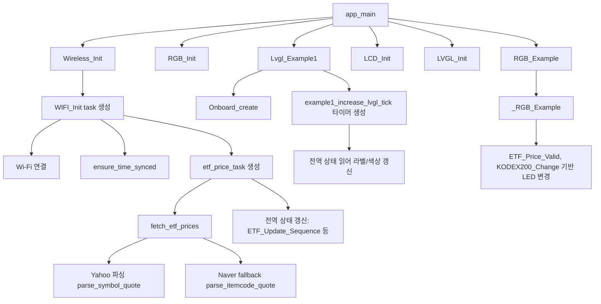

# ESP32-C6-LCD-1.47 예제를 KODEX200 시세 표시기로 바꿔보기 — 상편

  ESP-IDF
  LVGL
  KODEX200

이번 프로젝트는 ESP32-C6-LCD-1.47 보드의 기본 예제를 바탕으로, KODEX200 ETF 값을 가져와 LCD에 표시하는 형태로 바꿔본 작업이다. 원래 예제는 디스플레이와 LVGL 구동 확인에 초점이 맞춰져 있었지만, 여기에 Wi-Fi 연결, HTTPS 통신, 주기적 데이터 갱신, UI 표시를 붙여 조금 더 실용적인 시세 보드 형태로 확장했다. 상편에서는 개발 환경과 예제 구조, 그리고 외부 데이터를 끌어오기 위해 추가한 네트워크 계층을 정리한다.

> **하편** 에서는 받은 데이터를 LCD에 표시하는 UI 구성, RGB LED 상태 표시, 그리고 바이브 코딩 경험의 정리를 다룬다.

---

## 📸 완성 화면

<!-- 여기에 완성 화면 사진 삽입 -->

캡션: ESP32-C6-LCD-1.47 보드에서 KODEX200 시세를 표시하는 최종 화면. 예제 데모 UI를 정보 표시용 화면으로 바꿔 가격, 등락값, 등락률을 한 번에 확인할 수 있도록 구성했다.

이 프로젝트의 핵심은 새 애플리케이션을 처음부터 만드는 대신, 이미 동작하는 예제의 구조를 유지한 채 데이터 입력부와 화면 출력부를 목적에 맞게 바꿨다는 점이다. 결과적으로 LCD 출력, 무선 연결, 시세 갱신, 상태 표시가 하나의 흐름으로 묶인 작은 시세 보드가 되었다.

---

## 1. 개발 환경과 출발점

개발은 ESP-IDF 5.4.1 기준으로 진행했고, 대상 보드는 ESP32-C6-LCD-1.47이다. 플래시는 UART 방식으로 진행했고, LCD와 RGB LED, SD, Wi-Fi가 한 프로젝트 안에서 함께 동작하도록 구성했다. 이런 종류의 보드는 센서 없이도 네트워크 데이터와 UI를 바로 연결해볼 수 있다는 점에서, 예제 코드를 실용적인 결과물로 확장하기에 꽤 좋은 출발점이다.

환경 구성은 길게 적기보다 재현에 필요한 정보만 짧게 남기는 편이 기술 블로그에 더 잘 맞는다. 실제로 개발에 사용한 타깃 칩, 포트, 플래시 방식은 [.vscode/settings.json](.vscode/settings.json#L2) 부근에 정리되어 있고, 여기서 타깃이나 포트가 어긋나면 이후 빌드와 다운로드 과정에서 바로 문제가 생긴다.

간단히 정리하면 이번 프로젝트의 전제 조건은 아래 정도면 충분하다.

- ESP-IDF 5.4.1
- esp32c6 타깃
- COM14 포트
- UART 플래시 방식

---

## 2. 원본 예제 구조는 어떻게 되어 있었나

프로젝트 구조를 이해하는 가장 빠른 방법은 [main/main.c](main/main.c#L13) 를 먼저 보는 것이다. 이 파일에는 무선 기능 초기화, RGB 초기화, SD 초기화, LCD 초기화, LVGL 초기화, 그리고 최종 화면 생성까지의 흐름이 순서대로 들어 있다. 임베디드 프로젝트에서는 초기화 순서가 안정성과 직접 연결되기 때문에, 기능을 추가하더라도 이 순서를 크게 흔들지 않는 것이 중요했다.

특히 이 프로젝트에서는 Wireless_Init 이후 LCD와 LVGL을 순차적으로 올리고, 마지막 루프에서 lv_timer_handler 를 주기적으로 호출하는 구조를 유지했다. 이 부분은 단순한 보일러플레이트처럼 보여도 실제로는 UI가 계속 갱신되기 위한 핵심 조건이다. 예제 기반 프로젝트를 수정할 때는 바로 기능을 덧붙이기보다, 먼저 이런 앱 시작 흐름을 읽고 어디에 무엇을 끼워 넣을지 판단하는 것이 훨씬 안전하다.

코드를 조금 더 들여다보면 [main/main.c](main/main.c#L15) 부근의 호출 순서는 사실상 의존 관계를 드러낸다. Wireless_Init 은 이후 화면에 표시할 데이터의 공급원을 준비하고, RGB_Init 과 RGB_Example 은 별도 태스크 기반 상태 표시를 시작한다. 그다음 SD와 LCD를 준비한 뒤 LVGL_Init 과 Lvgl_Example1 을 호출하는데, 이 순서 덕분에 화면 객체가 만들어지는 시점에는 이미 주변 장치 초기화가 끝난 상태가 된다. 즉, main.c 는 단순 시작 파일이 아니라 각 모듈의 책임이 어디서 연결되는지를 가장 압축적으로 보여주는 파일이다.

<!-- 여기에 앱 구조 설명용 코드 스크린샷 삽입 -->

캡션: 앱 시작 시 무선, LCD, LVGL이 어떤 순서로 초기화되는지 보여주는 진입점. 예제 구조를 유지하면서 필요한 기능만 덧붙이는 방향으로 접근했다.

### 코드 캡처 1. 앱 시작 흐름

<!-- 사진 넣을 곳: main_main_flow.png -->

추천 캡처 범위: [main/main.c](main/main.c#L13)

이 코드는 프로젝트 전체를 가장 짧게 설명해 주는 진입점이다. 무선 초기화부터 RGB 상태 표시, LCD 준비, LVGL 초기화, 그리고 사용자 화면 생성까지가 한 함수 안에서 이어진다. 블로그에서는 이 캡처를 먼저 보여준 뒤, "이 프로젝트는 데이터를 가져오는 모듈과 화면을 그리는 모듈을 별도로 두고, main.c 에서 이 둘을 연결한다"고 설명하면 흐름이 바로 잡힌다.

특히 마지막 while 루프에서 lv_timer_handler 를 반복 호출하는 부분은 단순 반복문이 아니라 LVGL 화면이 계속 살아 있도록 만드는 핵심 루프다. 이 한 장의 캡처만으로도 예제 기반 프로젝트를 어떻게 확장했는지를 꽤 설득력 있게 보여줄 수 있다.

---

## 2-1. 함수 호출 순서로 보는 전체 동작

맞다. 이 주제는 파일 링크 중심 설명보다 함수 단위 캡처 + 호출 흐름 설명이 훨씬 이해가 쉽다. 그래서 본문에서는 아래 순서로 "함수가 어떻게 이어져서 동작하는지"를 먼저 보여주고, 그다음 각 함수 캡처를 붙이는 구성을 추천한다.

### 함수별 설명 요약

1. 앱 진입과 모듈 연결
- 함수: app_main
- 위치: [main/main.c](main/main.c#L13)
- 역할: 네트워크, RGB, LCD, LVGL을 초기화하고 메인 루프에서 lv_timer_handler 를 반복 호출한다.
- 캡처 이유: 전체 아키텍처를 한 장으로 설명할 수 있다.

2. 네트워크 시작점
- 함수: Wireless_Init
- 위치: [main/Wireless/Wireless.c](main/Wireless/Wireless.c#L729)
- 역할: NVS 초기화 후 WIFI_Init 태스크를 생성한다.
- 캡처 이유: "앱 시작"과 "네트워크 태스크"가 연결되는 지점이다.

3. Wi-Fi 연결과 시세 태스크 기동
- 함수: WIFI_Init
- 위치: [main/Wireless/Wireless.c](main/Wireless/Wireless.c#L761)
- 역할: Wi-Fi 스택 초기화, 이벤트 핸들러 등록, 연결 시도, 시간 동기화 후 etf_price_task 생성.
- 캡처 이유: 실제 런타임 시작 조건(연결 성공 후 태스크 시작)이 드러난다.

4. 시세 수집 메인 루프
- 함수: etf_price_task
- 위치: [main/Wireless/Wireless.c](main/Wireless/Wireless.c#L625)
- 역할: 주기적으로 fetch_etf_prices 를 호출하고 전역 상태를 갱신한다.
- 캡처 이유: 데이터 수집 주기와 UI 반영의 시작점이 보인다.

5. 데이터 소스 조회와 정규화
- 함수: fetch_etf_prices
- 위치: [main/Wireless/Wireless.c](main/Wireless/Wireless.c#L548)
- 역할: Yahoo 조회 우선, 실패 시 Naver fallback, 결과를 공통 포맷으로 정리.
- 캡처 이유: 장애 대응과 데이터 정규화를 동시에 보여준다.

6. Yahoo/Naver 파싱 핵심
- 함수: parse_symbol_quote, parse_itemcode_quote
- 위치: [main/Wireless/Wireless.c](main/Wireless/Wireless.c#L271), [main/Wireless/Wireless.c](main/Wireless/Wireless.c#L355)
- 역할: 문자열 기반 JSON 필드 추출, 가격/등락/등락률 값 변환.
- 캡처 이유: 메모리 절약형 파싱 전략과 trade-off 설명에 좋다.

7. UI 생성 시작점 *(하편에서 자세히 다룸)*
- 함수: Lvgl_Example1, Onboard_create
- 위치: [main/LVGL_UI/LVGL_Example.c](main/LVGL_UI/LVGL_Example.c#L71), [main/LVGL_UI/LVGL_Example.c](main/LVGL_UI/LVGL_Example.c#L227)
- 역할: 스타일 초기화 후 시세 표시 레이아웃을 만든다.

8. UI 실시간 갱신 *(하편에서 자세히 다룸)*
- 함수: example1_increase_lvgl_tick
- 위치: [main/LVGL_UI/LVGL_Example.c](main/LVGL_UI/LVGL_Example.c#L270)
- 역할: ETF_Update_Sequence 를 기준으로 진행 바와 텍스트/색상을 갱신한다.

9. 보조 상태 표시 *(하편에서 자세히 다룸)*
- 함수: _RGB_Example
- 위치: [main/RGB/RGB.c](main/RGB/RGB.c#L30)
- 역할: 데이터 유효 여부와 등락 방향에 따라 LED 색상을 변경한다.

### 함수 캡처 템플릿

아래 형식을 함수 캡처마다 반복하면 글이 깔끔해진다.

- 함수명:
- 호출 주체:
- 입력/참조 상태:
- 출력/부수효과:
- 실패 시 동작:
- 이 함수를 캡처한 이유:

---

## 3. KODEX200 데이터를 가져오기 위해 추가한 것들

실제 시세 표시기로 동작하려면 네트워크 계층이 먼저 안정적으로 붙어야 한다. 이 프로젝트에서는 [main/Wireless/Wireless.c](main/Wireless/Wireless.c#L38) 에서 Wi-Fi 연결, SSID 후보 전환, 시간 동기화, HTTPS 요청과 같은 흐름을 담당한다. 단일 SSID만 고정해 두는 대신 여러 후보를 배열로 관리하고 실패 시 다음 후보로 넘어가도록 만든 점은 실제 사용성을 고려한 설계다. 공유기 위치나 설치 장소가 바뀌면 같은 장치라도 네트워크 조건이 꽤 달라질 수 있기 때문이다.

또 하나 중요한 포인트는 HTTPS 요청 전에 시간을 맞추는 처리다. [main/Wireless/Wireless.c](main/Wireless/Wireless.c#L125) 에는 SNTP로 시스템 시간을 맞추는 로직이 들어 있는데, 인증서 검증이 필요한 연결에서는 시간이 크게 틀어져 있으면 요청 자체가 실패할 수 있다. 데스크톱 환경에서는 거의 의식하지 않는 부분이지만, 임베디드 장치에서는 꽤 자주 부딪히는 문제다.

실제 시세 조회는 Yahoo Finance 쿼리를 먼저 시도하고, 실패 시 Naver Finance 기반 조회로 fallback 하는 구조로 짜여 있다. 이 부분은 [main/Wireless/Wireless.c](main/Wireless/Wireless.c#L556) 부근에서 확인할 수 있다. 즉, 단순히 값을 받아오는 것이 아니라 데이터 소스 실패에도 어느 정도 대응하도록 설계된 셈이다.

또한 종목 심볼과 갱신 주기는 코드에 하드코딩하지 않고 [main/Kconfig.projbuild](main/Kconfig.projbuild#L74) 에서 설정값으로 분리했다. 이런 구조 덕분에 KODEX200 외 다른 종목으로 바꾸거나 업데이트 주기를 조정할 때도 코드를 크게 수정할 필요가 없다.

여기서 흥미로운 점은 JSON 처리를 무거운 파서 라이브러리로 하지 않고, 문자열 검색 기반으로 필요한 필드만 직접 뽑아낸다는 것이다. [main/Wireless/Wireless.c](main/Wireless/Wireless.c#L271) 의 parse_symbol_quote 는 symbol, regularMarketPrice, regularMarketChange, regularMarketChangePercent 같은 키를 strstr 로 찾고 strtod 로 숫자로 변환한다. 구현은 단순하지만, 필요한 값이 몇 개 되지 않는 임베디드 환경에서는 메모리 사용량과 코드 복잡도를 낮출 수 있다는 장점이 있다. 대신 응답 JSON 구조가 바뀌면 쉽게 깨질 수 있다는 점은 분명한 trade-off 다.

fallback 쪽도 비슷하다. [main/Wireless/Wireless.c](main/Wireless/Wireless.c#L355) 의 parse_itemcode_quote 는 Naver 응답에서 종목 코드와 현재가, 전일 대비, 등락률을 직접 찾아 해석한다. 특히 rf 플래그를 보고 상승과 하락 부호를 다시 맞추는 부분은, 단순 숫자 파싱만으로는 부족한 시장 데이터 해석 로직이 어디에 들어가야 하는지를 잘 보여준다. 즉, 이 모듈은 단순 HTTP 클라이언트가 아니라 "시세 데이터 정규화 계층"에 더 가깝다.

또 한 가지 눈에 띄는 건 상태 공유 방식이다. [main/Wireless/Wireless.h](main/Wireless/Wireless.h#L16) 에 선언된 전역 상태 값들은 네트워크 태스크, UI, RGB 표시가 모두 참조하는 공용 데이터다. etf_price_task 가 가격과 등락폭, 상태 문자열, 업데이트 시퀀스를 갱신하면 LVGL 타이머와 RGB 태스크가 이를 읽어 각자 화면과 LED를 바꾼다. 구조는 단순하지만, "수집", "표시", "보조 표시"를 느슨하게 분리하면서도 별도 메시지 큐 없이 연결했다는 점에서 꽤 실용적이다.

<!-- 여기에 Wi-Fi 후보 / 시간 동기화 / 시세 요청 코드 스크린샷 삽입 -->

캡션: 시세 조회 전에 Wi-Fi 연결과 시간 동기화를 먼저 맞추고, Yahoo 조회 실패 시 다른 경로를 시도하도록 구성한 네트워크 처리 흐름.

### 코드 캡처 2. 시세 조회와 fallback 처리

<!-- 사진 넣을 곳: wireless_fetch_fallback.png -->

추천 캡처 범위: [main/Wireless/Wireless.c](main/Wireless/Wireless.c#L556)

이 부분은 블로그에서 꼭 보여줄 가치가 있다. 먼저 Yahoo Finance URL을 만들고 데이터를 요청한 뒤, 파싱에 실패하면 Naver 기반 조회로 넘어가는 흐름이 한 번에 드러나기 때문이다. 단순히 "외부 API를 썼다"는 설명보다, 실제 실패를 가정하고 fallback 경로를 넣었다는 점이 코드 수준에서 보이는 장면이다.

여기서는 "이 모듈은 HTTP 호출만 하는 것이 아니라, 서로 다른 응답 형식을 공통 상태값으로 정리하는 역할까지 맡는다"고 설명하면 좋다. 그 한 문장만 있어도 글이 단순 제작기를 넘어서 설계 분석에 가까워진다.

---

> **하편** 에서는 받은 데이터를 LCD에 표시하는 UI 레이아웃과 갱신 로직, RGB LED를 활용한 보조 상태 표시, 그리고 바이브 코딩 방식으로 진행했을 때 임베디드에서 직접 검증이 필요했던 부분을 정리한다.

